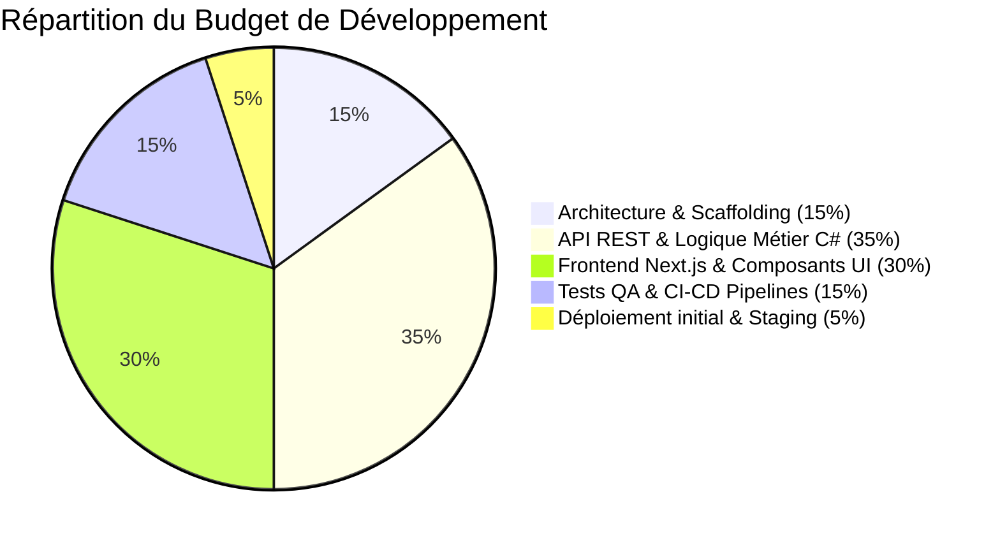

# Rapport d'Estimation des Coûts & Architecture Cible — TheDinner

Ce document présente l'estimation financière complète (développement et opérations) ainsi que les choix d'infrastructure recommandés pour la mise en production du système de digitalisation de restaurant **TheDinner**.

---

## 1. Choix Technologiques & Infrastructure

> [!NOTE]
> Nous privilégions une approche pragmatique combinant des conteneurs légers (Docker) et des services managés pour réduire la charge de maintenance de l'équipe système.

### Base de Données : PostgreSQL
* **Pourquoi ce choix ?** Déjà intégré dans la stack via EF Core et Npgsql, PostgreSQL est le standard de l'industrie pour les bases de données relationnelles open-source. Il garantit la cohérence stricte des données (transactions ACID) indispensables pour la facturation et le suivi des commandes.
* **Format en production** : Une base de données managée (**Managed Database**) est fortement recommandée pour assurer les sauvegardes automatiques, le chiffrement des données et la haute disponibilité.

### Machine Virtuelle (VM) & Hébergement
* **Hébergeurs recommandés** : **Scaleway** ou **OVHcloud** pour la souveraineté des données en France et des tarifs très compétitifs, ou **AWS / GCP / Azure** si vous disposez déjà d'une infrastructure cloud existante.
* **Dimensionnement de la VM** : Une seule instance **Scaleway GP1-XS** (ou **AWS t3.medium**) disposant de **2 vCPUs** et de **4 à 8 Go de RAM** est largement suffisante pour héberger l'ensemble de la stack d'applications conteneurisées.

```mermaid
graph TD
    Client[Navigateur Client & Serveur] -- "HTTPS (Port 443)" --> Proxy[Reverse Proxy: Nginx / Traefik]
    Proxy -- "Port 3000" --> Front[Next.js Frontend]
    Proxy -- "Port 8080" --> API[.NET 9 API REST]
    API -- "Port 5432" --> DB[(Managed PostgreSQL)]
    
    subgraph VM Hébergée "Scaleway GP1-XS (2 vCPUs, 8 Go RAM)"
        Proxy
        Front
        API
        Monitor[Prometheus + Grafana]
    end
    
    subgraph Service Managé Cloud
        DB
    end
```

---

## 2. Estimation des Coûts Opérationnels Récurrents (Mensuels)

Le budget mensuel pour maintenir le système en ligne avec des performances optimales et un taux de disponibilité élevé :

| Catégorie | Solution proposée | Spécifications | Coût Mensuel Estimé |
| :--- | :--- | :--- | :---: |
| **Base de Données** | Managed PostgreSQL (Scaleway) | 1 vCPU, 2 Go RAM, 20 Go SSD nvme | **16,00 €** |
| **Serveur Applicatif** | VM GP1-XS (Scaleway) | 2 vCPUs, 8 Go RAM, 50 Go SSD nvme | **12,00 €** |
| **Nom de domaine** | Registar (.fr / .com) | Achat annuel | **1,00 €** |
| **Sauvegardes (Backups)** | Object Storage (S3-compatible) | 50 Go de stockage archivé hors-site | **1,00 €** |
| **Certificats SSL** | Let's Encrypt | Certificat HTTPS gratuit renouvelé | **Gratuit** |
| **TOTAL ESTIMÉ** | | | **~30,00 € HT / mois** |

---

## 3. Estimation du Budget de Développement Initial

Pour concevoir, coder, tester et déployer l'intégralité de l'application selon les standards de l'art (Clean Architecture, couverture de tests > 80%, intégration du cycle de vie et de la sécurité CI/CD) :

> [!TIP]
> L'estimation repose sur une charge de travail de **15 à 20 jours-homme** effectuée par un ingénieur d'étude Full-Stack / DevOps senior expérimenté.

### Décomposition du budget de création :



| Phase | Activités comprises | Charge estimée | Budget Estimé (TJM 500 €) |
| :--- | :--- | :---: | :---: |
| **1. Architecture & Base** | Configuration Clean Architecture, structures EF Core, Docker-compose initial. | 3 jours | **1 500,00 € HT** |
| **2. API & Logique C#** | Entités, endpoints, gestion des transactions de paiements, stratégies. | 7 jours | **3 500,00 € HT** |
| **3. Interface Next.js** | Pages serveur/cuisine/admin interactives, intégrations API. | 6 jours | **3 000,00 € HT** |
| **4. Tests & CI/CD** | Écriture tests unitaires et intégration, pipeline GitHub Actions, SonarCloud. | 3 jours | **1 500,00 € HT** |
| **5. Déploiement** | Provisionnement infrastructure de recette/production et mise en service. | 1 jour | **500,00 € HT** |
| **TOTAL ESTIMÉ** | | **20 jours** | **10 000,00 € HT** |

---

## 4. Synthèse des Bénéfices de la Stack Choisie

> [!IMPORTANT]
> * **Rentabilité immédiate** : Un coût d'exploitation mensuel de moins de 35 € permet d'amortir le système dès les premiers jours d'utilisation.
> * **Sécurité & Conformité** : L'utilisation d'une base PostgreSQL managée protège le restaurant contre la perte de données en cas de panne matérielle.
> * **Évolutivité future** : L'architecture découplée (.NET API / Next.js / Docker) permet de faire évoluer le système (ajout d'une application mobile, gestion multi-restaurants) sans perturber le fonctionnement actuel.
